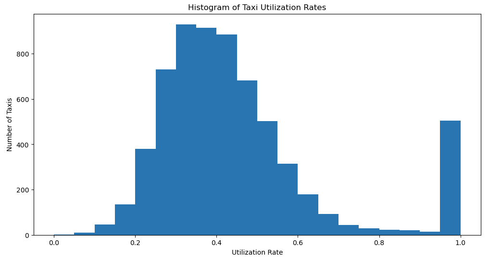
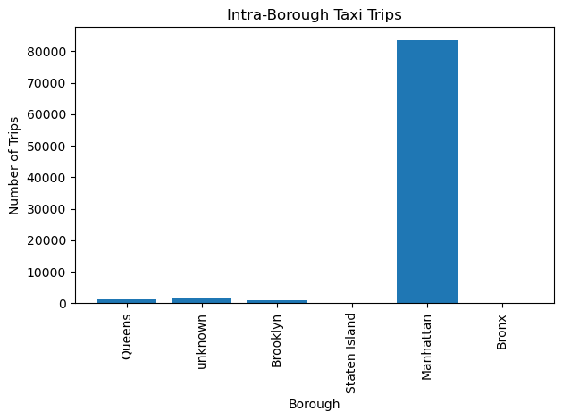
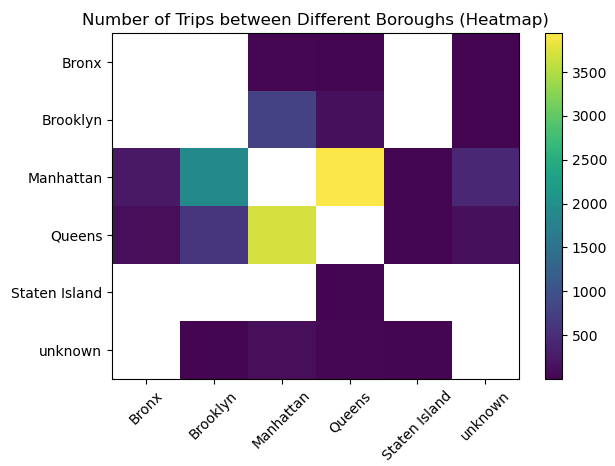

Project 1 Analyzing New York City Taxi Data


Project [Big Data](https://courses.cs.ut.ee/2025/bdm/spring/Main/HomePage) is provided by [University of Tartu](https://courses.cs.ut.ee/).

Students: Alejandro Ballesteros Perez, Phasha Davrishev, Roman Krutsko, Nika Mgaloblishvili

## License
This project is licensed under the [Apache License 2.0](LICENSE).

## Introduction  

This report analyzes taxi trip data in New York City using a sample dataset provided on Moodle. The dataset is derived from a larger dataset available at [this link](http://www.andresmh.com/nyctaxitrips/). Each row in the dataset represents a single taxi ride, containing attributes such as:  

- A unique identifier for the taxi (hashed license number)  
- Pickup and drop-off locations (longitude/latitude)  
- Pickup and drop-off timestamps  

Additionally, a `.geojson` file is included to provide the geographical boundaries of NYC boroughs, which is essential for analyzing borough-based trips.  

## Objectives  

This report focuses on several key metrics related to taxi utilization and trip patterns:  

1. **Utilization** – The fraction of time a cab is occupied by passengers.  
2. **Average Wait Time for Next Fare** – The time between a trip’s drop-off and the next trip’s pickup, categorized by drop-off borough.  
3. **Intra-Borough Trips** – The number of trips that both started and ended within the same borough.  
4. **Cross-Borough Trips** – The number of trips that started in one borough and ended in another.  

The dataset is processed using Apache Spark to efficiently handle large-scale data operations. The analysis helps uncover key insights about NYC taxi trip patterns, including the most frequent borough-to-borough travel routes.  


## Queries 

### Query 1 | Utilization

This query calculates each taxi’s utilization rate based on trip data. First, it identifies how much time each taxi spends idle by comparing each trip’s pickup time to the previous trip’s dropoff time (using a window function grouped by medallion). Any idle gap longer than four hours resets to zero (treated as a new session). The code then sums each taxi’s total busy time (duration) and idle time to compute utilization rate.

Each taxi’s utilization rate is computed as:
```bash
utilization_rate = busy_time_sum / (busy_time_sum + idle_time_sum)
```

busy_time_sum: Total trip duration across all trips for a given taxi.
idle_time_sum: Total idle time below the 4-hour threshold.

#### Data



#### Observations and Insights

The majority of taxis have a utilization rate between 30% and 40%. Around 500 taxis have utilization rates close to 100%, however this is 
due to the fact that they have a small number of trips present in the dataset.

### Query 2 - Average Wait Time for Next Fare
This query calculates the average wait time for the next fare after a drop-off, categorized by borough. First, the `time_to_next_fare` is calculated as the difference between the drop-off time of the current trip and the pickup time of the next trip(`next_pickup_timestamp`). 

The averages for each borough are calculated as:
```bash
avg_time_per_borough = (
    a_taxi_df.groupBy("dropoff_borough")
    .agg(avg("time_to_next_fare").alias("avg_time_to_next_fare"))
)
```


#### Data

From the dataset, we calculated the average wait time for next fare for each borough
Here is detailed data that was received:
*   Queens - 6368.42
*   Brooklyn - 6554.84
*   Manhattan - 2048.92
*   Bronx - 4973.71
*   Staten Island - 13935.0
*   Outside of NYC (drop out borough) - 12206.93

#### Observations and Insights

After analysis of average wait time for next fare, it can be concluded that Manhattan has the lowest wait time of around 2048.92 seconds, second least time of wait is in Bronx, Queens and Brooklyn have almost identical data, while Staten Island which is the farthest borough from the city center has the longest wait time.

### Query 3 - Intra-Borough Trips

From a dataset of 99,549 NYC taxi trips, we filtered for trips that both started and ended within the same borough. We counted these intra-borough trips. The resulting count is 87,477.

The used query is:
```bash
same_borough_trips_df = filtered_taxi_df.filter(col("pickup_borough") == col("dropoff_borough"))
```

#### Data


#### Observations and Insights

After analyzing intra-borough taxi trips within New York City, Manhattan is the most popular borough for trips that are within the same borough.

### Query 4 - Cross-Borough Trips

The dataset consists of a total of 99,549 trips. Of these, 12,120 are cross-borough trips—meaning the pickup borough is different from the dropoff borough.

1. **Filtering Cross-Borough Trips**  
   The first query filters the dataset to include only those trips where `pickup_borough != dropoff_borough`. It then counts these filtered rows to determine the total number of cross-borough trips (12,120).

2. **Breakdown by Borough Pair**  
   Next, the second query groups the cross-borough trips by both `pickup_borough` and `dropoff_borough`, then counts these groups. This breakdown helps us see which specific borough-to-borough pairings have the highest number of trips.

#### Data



#### Observations and Insights

Approximately 90% of the trips were taken with the source and detination being in the same borough


## Conclusion

1. Driver utilization varies significantly, however it can be seen that the most common utlization rate hovers around 30% - 40%
2. Most trips are not cross-boroughs, however trips Between Manhattan and Queens are the most taken cross-borough.