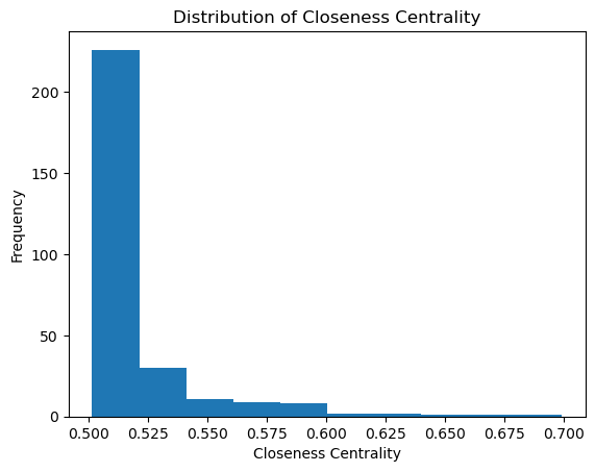

Project 3 Analysing Flight Interconnected Data


Project [Big Data](https://courses.cs.ut.ee/2025/bdm/spring/Main/HomePage) is provided by [University of Tartu](https://courses.cs.ut.ee/).

Students: Alejandro Ballesteros Perez, Phasha Davrishev, Roman Krutsko, Nika Mgaloblishvili

## License
This project is licensed under the [Apache License 2.0](LICENSE).

## Introduction
This report analyzes flight data in the USA, by representing the data as a graph. Each airport is represented as a vertex, and each flight is represented as an edge between two vertices. The goal is to analyze the graph structure and compute various statistics, such as in-degree, out-degree, triangle counts, centrality measures, and PageRank.

## Queries

### Query 1 | Compute different statistics

We calculated different statistics for flights to analyze flights data.
Out-degree, which is the number of flights leaving the airport is calculated using this formula:

```python
out_degree = edges.groupBy("src").agg(count("*").alias("out_degree")) \
                  .withColumnRenamed("src", "id")
```

In-degree is the number of flights arriving at each airport, is calculated using this formula:

```python
in_degree = edges.groupBy("dst").agg(count("*").alias("in_degree")) \
                 .withColumnRenamed("dst", "id")
```

Total degree is combined, formula:

```python
degree_df = vertices.join(in_degree, on="id", how="left") \
                    .join(out_degree, on="id", how="left") \
                    .na.fill(0) \
                    .withColumn("total_degree", col("in_degree") + col("out_degree"))
```

Triangle count is number of sets of three vertices, where each vertex is connected to the other two by edges,
forming a cycle of length three. In case of my implementation,
the algorithm first normalizes the edges, collects neighbors for each vertex, joins these neighbor sets based on
adjacent edges to find candidate vertex pairs, and then counts the number of intersections to determine the triangles
each vertex is part of.
The GraphFrames implementation deduplicates edges and uses its built-in motif-finding functionality to directly locate
triangle patterns. Then it aggregates the results by exploding the found vertices and grouping to count each vertex's
participation. 
Our implementation manually normalizes edges, builds neighbor sets, and identifies triangles by joining these sets and
computing their intersections, that is why there is a difference in some counts.

### Query 2 | Total number of triangles in the graph

To count total number of triangles in graph, we have to combine the results of all airports using this formula:

```python
total_triangles = triangle_counts.agg(F.sum("triangleCount").alias("total")).collect()[0]["total"]
```

As we can see, the result of total triangles from GraphFrames has to be divided by 3, as it accounted for three times
when aggregating vertex counts. So comparing the total count of triangles calculated by our implementation and built-in
GraphFrames `graph.triangleCount()`, we can see that count is same, which is `15991`.

### Query 3  | Closeness Centrality
Closeness centrality measures how close each vertex is to all other vertices in the graph. Formally, for a vertex 𝑣v, its closeness centrality can be defined as the reciprocal of the average shortest-path distance from 𝑣v to all other reachable vertices:


Where 𝑑(𝑣,𝑢)d(v,u) is the shortest-path distance between 𝑣v and 𝑢u, and ∣𝑉∣∣V∣ is the total number of vertices in the graph.

In this implementation, we approximate the shortest-path distances by performing a BFS-like traversal from each vertex up to a specified depth (max_depth). For each source vertex:

1. Initialize the source with distance 0.

2. Expand outward (frontier) one edge at a time, assigning distances 1,2,3,... to newly discovered vertices until all reachable vertices are visited or until max_depth is reached.

3. Compute the sum of distances to all reachable vertices.

4. The closeness centrality is then 1/avg_distance (or 0 if no vertices are reachable).

At the end of each BFS, we store (vertex_id, closeness_centrality) in a Spark DataFrame. The code below demonstrates this procedure.

#### Code

For a given source vertex, we create a distance column, setting it to 0 for the source itself and leaving it undefined for others:

```python
visited = vertices.withColumn("distance", when(col("id") == source, lit(0)))
frontier = visited.filter(col("id") == source)
depth = 0
```

While our frontier (the set of newly discovered vertices at each depth) is not empty, we move outward by one edge:

```python
while frontier.count() > 0 and depth < max_depth:
    next_frontier = (frontier.join(edges, frontier["id"] == edges["src"])
                              .select(edges["dst"].alias("id"))
                              .distinct())

    next_frontier = (next_frontier.join(visited, "id", "left_anti")
                                 .withColumn("distance", lit(depth + 1)))

    visited = visited.union(next_frontier).distinct()
    frontier = next_frontier
    depth += 1
```

* We find all direct neighbors of the current frontier.
* We ensure we only add newly found vertices (left_anti join on visited).
* We increment each newly found vertex’s distance by one.

After BFS completes for the source vertex, all reachable vertices have a defined distance. We filter out the source itself and any unreachable vertices:

```python
reachable = visited.filter((col("id") != source) & col("distance").isNotNull())
reachable_count = reachable.count()
```

We then compute the sum of distances to those reachable vertices:

```python
if reachable_count > 0:
    total_distance = reachable.agg({"distance": "sum"}).collect()[0][0]
    avg_distance = total_distance / reachable_count
    closeness = 1 / avg_distance if avg_distance > 0 else 0
else:
    closeness = 0
```

By repeating this BFS process for every vertex, we derive the closeness centrality across the entire graph. Higher closeness values indicate a vertex is “closer” on average to the rest of the graph, making it a more central hub in terms of network distance.

#### Graph 1

A bar chart showing (vertex_id, closeness_centrality) for a selected subset (top 20)


We see a few airports with closeness centrality around 0.70, indicating they can reach other airports very efficiently (in fewer hops).

The rest of the top 20 are still relatively high (around 0.60 or above), suggesting these nodes are also quite central within the flight network.

#### Graph 2

A histogram displaying how closeness centralities are distributed across all nodes.



The majority of airports have closeness centralities in a cluster around 0.50–0.52, with only a handful reaching or exceeding 0.60.

This distribution shows that while most airports are moderately well connected, only a small fraction are highly central. These tend to be major hubs that serve many routes, enabling shorter path distances to the rest of the network.

The large bar near 0.50 indicates that many airports have average distances similar to one another, forming a “main cluster” of moderately central vertices.


### Query 4  | PageRank
This query calculates the PageRank of each vertex in the graph. PageRank mesures the importance of each vertex based on the number of vertices connected to it and the PageRank of those vertices. The formula used for PageRank calculation is:


where d is the damping factor, which is set to 0.85 in our implementation. Damping factor represents a probability that a user will continue clicking on links, rather than starting a new random search. 
PageRank is an iterative algorithm, and the number of iterations is set to 10 in our implementation. 

In the implementation, PageRank of each vertex is initialized to 1.0. Afterwards, the contribution of each vertex to the PageRank of its neighbors is calculated, in the following way:

```python
(edges.join(ranks, edges.src == ranks.id)
                     .join(out_degree, edges.src == out_degree.id) # get all the vertices and number of outgoing edges
                     .select(
                         edges.dst.alias("id"),
                         (ranks["rank"] / out_degree["out_degree"]).alias("contrib") # contribution the destination vertex receives
                     ))
```
as can be seen, the contribution each vertex gives to its neighbors is calculated by dividing its PageRank by the number of outgoing edges. 

Then, the PageRank of each vertex is calculated by summing the contributions from all its neighbors and applying the damping factor:

```python
grouped_contributions = (contributions.groupBy("id")
              .agg(F.sum("contrib").alias("sum_contrib"))
              .select(
                  col("id"),
                  (((1 - damping) / N) + damping * col("sum_contrib")).alias("rank") # apply pagerank formula
              ))
```

Given the fact that not all vertices may have received contributions, a rank of (1 - damping) / N is given to such vertices, where N is the number of vertices in the graph:
```python
dangling = vertices.join(grouped_contributions.select("id"), "id", "left_anti") \
                       .withColumn("rank", F.lit((1 - damping) / N))
```

This process is repeated for 10 iterations, and the final PageRank of each vertex is obtained. The results are sorted in descending order to identify the most important vertices in the graph.
```python
ranks.orderBy("rank", ascending=False).show()
```

Afterwards the results are visualized using the networkx and matplotlib libraries. The vertices are represented as circles, and the size of each circle is proportional to the PageRank of the corresponding vertex. The graph is displayed using a spring_layout, which positions nodes using Fruchterman-Reingold force-directed algorithm


### Query 5 | Finding the Most Connected Airports Using Direct Flight Routes

To identify the most connected airports, we analyzed direct flight connections by treating each flight as a directed edge from ORIGIN to DEST. The goal was to compute how many unique airports each airport directly connects with (either as a departure or arrival point).

1. Selected distinct `(ORIGIN, DEST)` pairs from the dataset.
2. Created bidirectional edges by unifying both `(ORIGIN → DEST)` and `(DEST → ORIGIN)` to account for connections in both directions.
3. Grouped by each airport and counted the number of distinct connected airports using `countDistinct`.
4. Sorted the airports in descending order of connection counts.

This provided a ranked list of airports based on the number of unique direct connections they have. These represent the most connected nodes in the flight network and could indicate hub airports.

|airport|num_connections|
|-------|---------------|
|    ATL|            165|
|    ORD|            141|
|    DFW|            134|
|    DTW|            124|
|    MSP|            119|
|    ...|            ...|


### Visualization | Airport Connectivity Network

To visualize the network of airport connections, we exported the flight route data into a format compatible with NetworkX and used Matplotlib for visualization.

1. Converted the unique `(ORIGIN, DEST)` pairs from PySpark into a list of edges.

2. Created a directed graph using `networkx.DiGraph()` and added the route edges.

3. Calculated node sizes based on degree to emphasize the most connected airports.

4. Used `spring_layout` to lay out nodes in a visually pleasing manner.

5. Plotted nodes, edges, and labels with `matplotlib.pyplot`.

The resulting graph illustrates how airports are interconnected across the network. Highly connected hubs appear with larger nodes, and the edges show direct flight paths. This helps to visually identify central nodes in the flight network and observe the structural flow of connectivity.


