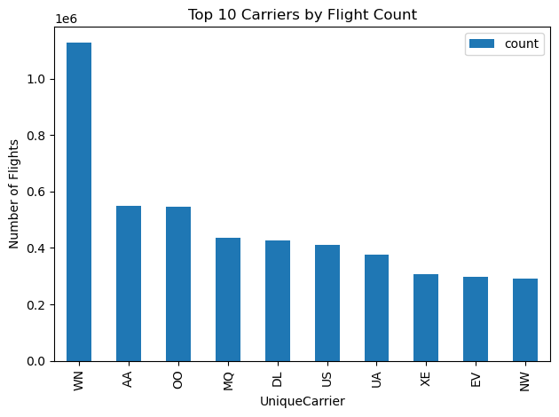
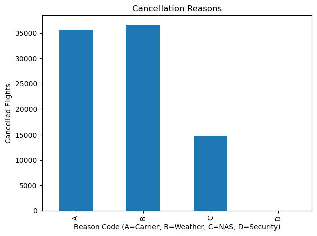
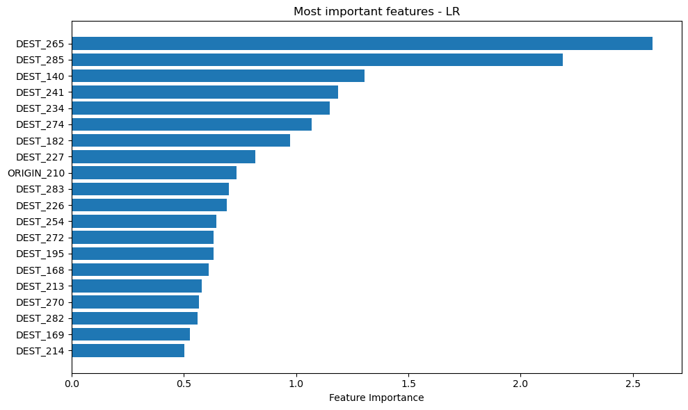

Project 4 Airline Delay and Cancellation Prediction with Spark ML

Project [Big Data](https://courses.cs.ut.ee/2025/bdm/spring/Main/HomePage) is provided by [University of Tartu](https://courses.cs.ut.ee/).

Students: Alejandro Ballesteros Perez, Phasha Davrishev, Roman Krutsko, Nika Mgaloblishvili

## License
This project is licensed under the [Apache License 2.0](../../LICENSE).

## Introduction
This project focuses on analyzing U.S flight data from 2009 to predict the flight cancellations. 
The dataset contains information about flights, including their origin and destination airports, delay information, cancellation reasons, and other relevant details.

## Tasks Overview

**Data Ingestion and Preparation/Cleaning and processing**: 

Fistly, the dataset was ingested from a CSV file and stored in a DataFrame. Afterwards necessary data preprocessing was performed: renaming columns, converting dates to the correct format, and creating new columns for month, and day of the week. Additionally, the records with missing values and diverted flights were removed. 

**Exploratory Data Analysis**:

In this step, exploratory data analysis was performed to understand the dataset better. Top 10 carriers by the flight count, and top cancellation reasons were visualized. Additionally, the imbalance ratio of the dataset was calculated - the dataset was imbalanced, with only ~1% of the flights being cancelled.

As shown in the plots, the top 10 carriers accounted for a significant portion of the total flights, with Southwest Airlines being the largest carrier. The top cancellation reasons were also visualized, with "Weather" being the most common reason for cancellations.

**Feature Engineering**:

Feature engineering was performed to create new features that could help improve the model's performance. StringIndexer was used to convert categorical variables into numerical indices. Additionally, OneHotEncoder was used to create new columns that represent each category as a separate feature. The features were then assembled into a single vector using VectorAssembler.
These transformations steps were combined into a single pipeline, which was then used to transform the data.

**Modeling**:

In this step, 4 different models where trained: Logistic Regression, Decision Tree, Random Forest, and Gradient Boosted Trees. Moreover the models where tuned using CrossValidator with 3 folds to find the best hyperparameters for each model.

Before training the models, the data was split into training and test sets with a ratio of 70:30. The metrics used to evaluate the models were accuracy, and AUC (Area Under the Curve).

After training the models, the predictions were made on the test set, and the results were evaluated using the metrics mentioned above. Based on the evaluation metrics, the best performing model was Logistic Regression with an accuracy of 0.9993 and AUC of 0.7909.

**Feature importances**:
The feature importances were calculated for the best performing model - Logistic Regression. Coefficients of the model were used to determine the importance of each feature. The features with the highest coefficients were considered the most important for predicting flight cancellations. The top 20 most important features were visualized using a bar plot.

As shown in the plot, the most important features were the one-hot encoded representations of destination airports. This suggests that the destination airport plays a significant role in the likelihood of a flight being canceled.

## Scoring data from 2010

The best performing model was used to score the data from 2010. For this, the same preprocessing steps as for 2009 data were applied. The model performed well on the 2010 data as well , with an accuracy of 0.9993 and AUC of 0.7740.

## Conclusion
Surprisingly, Logistic Regression outperformed the other models, including Random Forest and Gradient Boosted Trees (which might have overfitted on the training set). This suggests that the relationship between the predictors and the target variable is largely linear. Furthermore, based on the feature importances (model coefficients), the destination airport appears to be a key factor influencing the likelihood of flight cancellations.